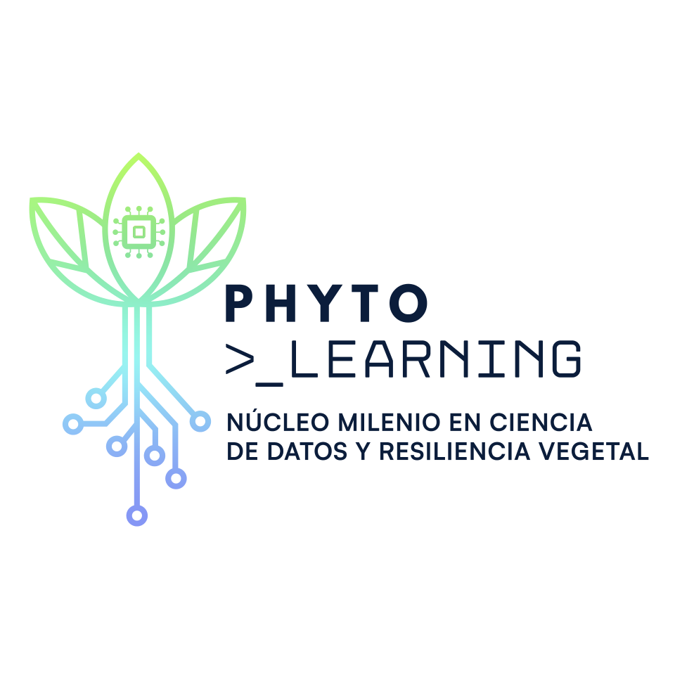

  
   
  
<b>Empowering plant science with AI, data, and genomics.</b>

  
  
  

 

Welcome to the official GitHub profile of **PhytoLearning**!

We are a research initiative focused on understanding plant adaptation, stress responses, and developing cutting-edge AI tools for agriculture and phenotyping. Our goal is to make our datasets and analysis scripts open to the community to foster collaboration among research labs.

---

## 🧬 Our Core Research Pillars

### 🌿 Plant Models
Identifying gene regulatory networks in ***Arabidopsis thaliana*** and **tomato** under water stress and nutritional changes. We utilize transcriptomic data to discover how these plants rewire their genetic networks to survive under extreme conditions.

### 🍅 Tomato Adaptation
Characterizing transcriptional mechanisms in **tomato varieties adapted to desert conditions**. We study their response to drought and nutritional variations to find key elements that could help improve future crop resilience.

### 🤖 AI and Phenotyping
Developing Artificial Intelligence tools for the **automatic phenotyping** of responses to water stress. By using machine learning models and image analysis, we aim to precisely quantify plant traits in a high-throughput manner.

---

## 🛠️ Projects & Tools

Projects developed by members of the PhytoLearning community. Original authorship resides with each developer.

| Project | Description | Author | Language |
|---|---|---|---|
| [Auto_Stomata](https://github.com/PhytoLearningCL/Auto_Stomata) | Extracción de parámetros morfológicos automatizada de estomas en imágenes microscópicas | [@pythonmarti](https://github.com/pythonmarti) | Python |
| [stress-ready](https://github.com/PhytoLearningCL/stress-ready) | Herramientas y pipelines de análisis de respuesta a estrés en plantas | [@JMALab](https://github.com/JMALab) | Python / R |
| [AgroXiao](https://github.com/PhytoLearningCL/AgroXiao) | Firmware para red mesh agrícola LoRa (XIAO ESP32S3) — sensores NPK, temperatura y humedad de suelo | [@BIOLIMON](https://github.com/BIOLIMON) | C++ |
| [phytoboard](https://github.com/PhytoLearningCL/phytoboard) | Dashboard de monitoreo de datos fitosanitarios en tiempo real | [@BIOLIMON](https://github.com/BIOLIMON) | TypeScript |
| [CDapp](https://github.com/PhytoLearningCL/CDapp) | Aplicación web con IA generativa para análisis de datos de cultivos (Gemini + React) | [@BIOLIMON](https://github.com/BIOLIMON) | TypeScript |
| [Scripts](https://github.com/PhytoLearningCL/Scripts) | Scripts generales de bioinformática y regulación génica | [@JMALab](https://github.com/JMALab) | Jupyter Notebook |
| [Consistently_drougth_regulated_genes](https://github.com/PhytoLearningCL/Consistently_drougth_regulated_genes) | Genes consistentemente regulados bajo sequía en distintas especies | [@JMALab](https://github.com/JMALab) | Markdown |
| [pgrlab-site](https://github.com/PhytoLearningCL/pgrlab-site) | Sitio web del laboratorio PGR — ciencia de plantas, genómica y recursos de investigación | [@BIOLIMON](https://github.com/BIOLIMON) | TypeScript |
| [R-no-muerde](https://github.com/PhytoLearningCL/R-no-muerde) | Guía introductoria de R y recursos de entrenamiento para biólogos | [@JMALab](https://github.com/JMALab) | R |
| [CienciaPublica](https://github.com/PhytoLearningCL/CienciaPublica) | Recursos y materiales de divulgación científica pública | [@JMALab](https://github.com/JMALab) | Markdown |

---

## 🚀 Open Science & Repositories

We strongly believe in Open Science. Here you will find our public scripts, pipelines, and tools:

- 📊 **[github_pytholearning](https://github.com/PhytoLearningCL/github_pytholearning-):** Our main open-source hub where research labs share data analysis scripts (R/Python) and phenotyping tools. *(Private until officially published)*

---

## 🤝 Join the Community

We actively encourage collaboration! If you are a researcher or developer:
1. Check out our repositories.
2. Fork the code and explore our data.
3. Submit your **Pull Requests** to help us build a robust open science ecosystem around plant genomics and AI.

 

  <h3>Technologies we use</h3>
  
  
  
  
  

